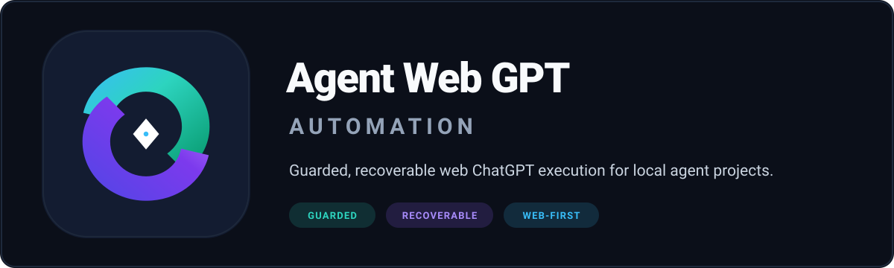

 <p align="center">
   
 </p>

 <p align="center">
   <a href="https://github.com/dbc-hbin/agent-web-gpt-automation/actions/workflows/release-portability.yml"></a>
   <a href="https://github.com/dbc-hbin/agent-web-gpt-automation/releases"></a>
   <a href="LICENSE"></a>
   
   
   
   
   
 </p>

 <p align="center">
   <strong>로컬 에이전트 프로젝트에 웹 ChatGPT를 안전하고 복구 가능한 실행 계층으로 연결하는 TypeScript CLI</strong>
 </p>

 <p align="center">
   한국어 · <a href="docs/README.md">문서 전체 보기</a> · <a href="docs/FIRST_INSTALL.md">최초 설치 가이드</a>
 </p>

 > [!IMPORTANT]
 > 이 저장소는 커뮤니티 프로젝트이며 OpenAI, Oracle 또는 DevSpace의 공식 제품이 아닙니다. ChatGPT 로그인, Developer Mode 앱 등록, DevSpace Owner 승인은 사용자가 직접 수행합니다. 브라우저 프로필, 세션 토큰, DevSpace Owner 암호를 저장소나 로그에 기록하지 않습니다.

 이 배포물은 **Node.js/TypeScript 1.0.0 전용 구현(`awgpt`)**입니다. 기존 Python 구현의 모든 기능(상태 관리, 락 소유권, 프로세스 감독, 프로필 격리, 영수증 기반 라이프사이클)을 단일 TypeScript 코드베이스로 마이그레이션하여 완성도 높은 CLI와 도구 체인을 제공합니다.

 ---

 ## 왜 awgpt를 쓰나요?

 | 구분 | 설명 |
 |---|---|
 | **Guarded (엄격한 보호)** | exact project root와 UTF-8 미션 SHA-256을 실행 전에 고정하여 허용되지 않은 디렉터리 접근을 원천 차단합니다. |
 | **Recoverable (안전한 복구)** | 중단되거나 불확실한 세션을 새로 제출하지 않고, 저장된 exact slug로 관찰(`live`)하거나 결과(`harvest`)를 안전하게 회수합니다. |
 | **Evidence-based (증거 기반 검증)** | 프로세스 종료 코드에 의존하지 않고, atomic 상태 파일, 영수증(receipt) 체인, durable output 마커와 단조적 세션 권위를 검증합니다. |
 | **Cross-platform (크로스 플랫폼)** | Windows(Process Tree 추적)와 macOS(POSIX Process Group) 전반에서 동일한 TypeScript CLI와 Vitest/E2E 테스트를 통과합니다. |
 | **Web-first Execution (웹 분리 실행)** | 무거운 탐색, 설계, 구현, 검토 작업을 웹 ChatGPT 세션에 격리 위임하여 로컬 에이전트의 컨텍스트 오염과 비용을 최소화합니다. |

 ---

 ## 아키텍처 및 실행 흐름

 `awgpt`는 [Oracle](https://github.com/steipete/oracle) 세션과 [DevSpace](https://github.com/Waishnav/devspace) MCP 연결을 중개하여 로컬 프로젝트와 웹 ChatGPT를 연결합니다.

 ```text
 로컬 에이전트 (Codex 기본 / CLI)
   └─ UTF-8 미션 + exact project root + SHA-256 해시 고정
        └─ Oracle 브라우저 세션 (수동 로그인 seed의 throwaway copy) → 웹 ChatGPT
             └─ DevSpace MCP (Tailscale Funnel 고정 HTTPS /mcp) → 승인된 exact root만 안전 격리 접근
                  └─ 결과 회수 및 Receipt / State / TASK_OUTCOME 검증 → 완료 또는 attention_required (단일 잠금 하 복구)
 ```

 ### 계층별 책임 및 경계

 | 계층 | 전담 영역 (Owns) | 절대 수행하지 않는 행위 (Must not own) |
 |---|---|---|
 | **로컬 에이전트** | 작업 범위, 실행 승인, 미션 바인딩, 결정론적 로컬 최종 검증 | 숨겨진 웹 실행 임의 조작, 추측 기반 복구 |
 | **awgpt (CLI/Core)** | exact root 자격, 프로세스 감독, 프로젝트 락, 상태/영수증 기록, 단조적 권위 관리 | 완료된 웹 결과물의 의미론적 임의 변경 |
 | **Oracle** | 로그인된 브라우저 세션 실행, DOM 증거 확인, wait / harvest 회수 | 프로젝트 파일시스템 임의 조작, 중복 제출 |
 | **DevSpace** | 사용자가 승인한 exact root 파일 읽기/쓰기 및 명령 실행 | 승인되지 않은 부모/외부 디렉터리 접근 |
 | **웹 ChatGPT** | 설계(Plan), 구현(Edit), 독립 검토(Review), 리서치 수행 | 계정 권한 임의 조작, 로컬 에이전트 제어 |

 ---

 ## 3분 빠른 시작

 ### 요구 사항

 - **Node.js**: `22.16.0` 이상
 - **npm**: 기본 패키지 관리자
 - **Chrome / Chromium**: 수동 로그인 및 Oracle 브라우저 구동용
 - **Oracle**: `0.17.1` (npx 또는 로컬 설치)
 - **DevSpace**: `1.0.4` (MCP 워크스페이스 서버)

 ### 소스에서 빌드 및 전역 설치

 ```bash
 git clone https://github.com/dbc-hbin/agent-web-gpt-automation.git
 cd agent-web-gpt-automation
 npm ci
 npm run build
 npm install -g .
 awgpt --help
 ```

 전역 설치 없이 프로젝트 경로에서 직접 실행할 수도 있습니다:

 ```bash
 node dist/index.js --help
 node dist/index.js doctor
 ```

 > [!TIP]
 > Windows PowerShell에서 실행 정책으로 스크립트 실행이 차단되는 경우 `npm.cmd` 및 `npx.cmd`를 사용하세요.

 ---

 ## 최초 연결 7단계 가이드

 순서를 바꾸지 않는 것이 중요합니다. 상세 가이드는 [최초 설치 가이드](docs/FIRST_INSTALL.md)를 참고하세요.

 ### 1단계: 고정 공개 경로 설정 (Tailscale Funnel 권장)
 - Tailscale CLI + Funnel을 활성화하여 고정 `*.ts.net` HTTPS 도메인을 확보합니다.
 - (Cloudflare named tunnel, ngrok static domain, custom proxy는 사용자가 수동 구성)

 ### 2단계: DevSpace 워크스페이스 및 허용 루트 설정
 ```bash
 # 설정 계획 미리보기
 awgpt workspace setup --root "$PWD"

 # 설정 적용
 awgpt workspace setup --root "$PWD" --apply
 ```
 - `devspace init` 화면에서 작업할 **모든 exact project root**와 public origin(`https://<기기도메인>.ts.net`, `/mcp` 제외)을 입력합니다. 드라이브 전체나 홈 디렉터리 전체는 등록하지 않습니다.

 ### 3단계: DevSpace Owner 암호 및 보안 관리
 - DevSpace 초기화 시 생성되는 고엔트로피 Owner 암호를 즉시 암호 관리자에 보관합니다.
 - 암호는 CLI 인자, 로그, Git, 이슈에 절대 복사하지 않으며, ChatGPT 최초 OAuth 승인 창에서만 직접 입력합니다.

 ### 4단계: 상주 복구 및 엔드포인트 진단
 ```bash
 awgpt doctor --project-root "$PWD" --devspace-url http://127.0.0.1:7676/mcp
 awgpt workspace doctor --root "$PWD"
 ```
 - DevSpace MCP endpoint 응답(인증 없는 GET에 `401` 반환) 및 프로필/상태/락 유효성을 fail-closed 방식으로 점검합니다.

 ### 5단계: Oracle 전용 격리 브라우저 수동 로그인
 ```bash
 awgpt doctor --open-profile-login
 ```
 - 일상 Chrome 프로필과 완전히 분리된 전용 로그인 브라우저를 열고 ChatGPT 로그인을 완료합니다.
 - 이후 모든 실행은 이 원본 seed의 throwaway copy를 사용하므로 다중 작업 간 세션 충돌이 방지됩니다.

 ### 6단계: ChatGPT Developer Mode 앱 수동 1회 등록
 1. ChatGPT **Settings** → **Security and login**에서 **Developer mode**를 켭니다.
 2. ChatGPT Plugins / Apps 화면에서 **+**를 선택합니다.
 3. 앱 이름으로 **`codex`** (또는 사용자 지정 이름)를 입력합니다.
 4. Connection URL에 `https://<고정주소>/mcp`를 입력합니다.
 5. 도구 메타데이터를 확인하고 연결을 생성한 뒤, DevSpace Owner 암호를 입력하여 승인합니다.

 ### 7단계: 일반 GPT 연결 및 동작 검증
 - Pro를 소비하지 않고 non-Pro 모델에서 `@codex` read probe를 수행하여 exact root 파일 목록을 조회합니다.
 - 사전 인증 및 DOM 유효성을 프롬프트 제출 없이 확인하려면:
   ```bash
   awgpt auth-preflight --copy-profile "$HOME/.oracle/login-profiles/manual-login-..."
   ```
 - 격리 프로필의 로그인이 풀렸다면 메인 Chrome 쿠키에서 안전하게 복구할 수 있습니다:
   ```bash
   awgpt auth-recover --copy-profile "$HOME/.oracle/login-profiles/manual-login-..."
   ```

 ---

 ## 모드 선택 및 작업 라우팅

 | 모드 | 목적 | 실행 경로 | 모델 및 특징 |
 |---|---|---|---|
 | `direct` | 질문, 단일 분석, 가벼운 작업 | Oracle + DevSpace | `gpt-5.6` (비-Pro 최고 추론 강도 `extra-high`) |
 | `plan` | 구현 전 아키텍처 및 설계 | Oracle (읽기 전용) | DevSpace 파일 읽기 전용으로 안전한 계획 수립 |
 | `review` | 코드 및 계획 독립 검토 | Oracle (읽기 전용) | 변경 사항 비파괴 검토 |
 | `edit` | 범위가 한정된 코드 수정·테스트 | Oracle + DevSpace | exact root 내 파일 수정 및 빌드/테스트 실행 |
 | `orchestrator` | 단일 세션 완결형 실행 | Oracle + DevSpace | 탐색-구현-검증을 한 세션에서 완결 |
 | `deep-research` | 공개 자료 심층 리서치 | Oracle Deep Research | DevSpace 없이 미션/자료 ZIP 직접 첨부 |
 | `ultra-economy` | 로컬 모델 비용 최소화 | Luna Max 지휘 + 웹 세션 | 로컬 소형 모델(`gpt-5.6-luna`) + 웹 분리 실행 |
 | `pro` | 고난도 설계 및 종합 작업 | GPT-5.6 Sol Pro + DevSpace | 사용자 명시 요청 시에만 활성화 (쿼터 보호) |

 상세 라우팅 원칙은 [전역 ChatGPT 라우팅](docs/GLOBAL_CHATGPT_ROUTING.md) 및 [초절약모드 가이드](docs/ULTRA_ECONOMY_MODE.md)를 참고하세요.

 ---

 ## CLI 전체 명령어 레퍼런스

 | 명령어 | 역할 | 주요 옵션 |
 |---|---|---|
 | `awgpt doctor` | DevSpace, 프로필, 상태 파일, 프로젝트 락 통합 진단 | `--project-root`, `--devspace-url`, `--copy-profile`, `--state`, `--recover`, `--open-profile-login` |
 | `awgpt auth-preflight` | 프롬프트 제출 없이 ChatGPT 인증 및 DOM 유효성 사전 검증 | `--copy-profile`, `--oracle-home`, `--chrome-path` |
 | `awgpt auth-recover` | 메인 Chrome 쿠키에서 ChatGPT/OpenAI 쿠키를 복호화해 격리 seed 복구 및 자동 원복 | `--copy-profile`, `--chrome-user-data`, `--chrome-profile`, `--oracle-home` |
 | `awgpt workspace` | DevSpace 워크스페이스 및 Tailscale Funnel 진단/설정 | `doctor [--root]`, `setup [--root] [--apply]` |
 | `awgpt local-gate` | 셸 우회 없는 결정론적 로컬 게이트 실행 및 SHA-256 해시 증명 | `--project-root`, `--argv`, `--env`, `--timeout-ms` |
 | `awgpt install` | `install-manifest.json` 파일을 에이전트 홈에 WAL/영수증과 함께 설치 | `--source`, `--agent-home` |
 | `awgpt update` | 기존 파일 백업 후 해시 검증과 함께 갱신 | `--source`, `--agent-home` |
 | `awgpt rollback` | 마지막 또는 지정 영수증을 기준으로 수정되지 않은 파일만 안전 복원 | `--agent-home`, `--receipt` |
 | `awgpt run` | exact root/mission을 바인딩하여 Oracle 워크플로 실행 | `--project-root`, `--mission`, `--dry-run`, `--oracle-command`, `--oracle-arg` |
 | `awgpt recover` | 저장된 state의 exact slug를 `live` 관찰 또는 `harvest` 회수 | `--state`, `--action live|harvest` |
 | `awgpt audit` | Oracle 프로세스 없이 미제출 증거 확인 | `--state` |
 | `awgpt stop` | 소유권과 live 상태가 입증된 경우에만 기록된 프로세스 안전 중지 | `--state` |

 ### `doctor` 진단 규격 및 종료 코드

 `awgpt doctor`는 `codex.chatgpt.agent-web-gpt-doctor/v1` 규격의 정형화된 JSON을 출력합니다.

 | 상태 | 종료 코드 | 의미 |
 |---|---:|---|
 | `PASS` | `0` | 모든 필수 진단 항목(DevSpace, 프로필, 상태 무결성, 락 가용성)이 정상임 |
 | `FAIL` | `1` | 잘못된 상태 파일, I/O 오류, 심볼릭 링크 위반 등 즉시 수정해야 할 결함 |
 | `BLOCKED` | `2` | 로그인 필요, DevSpace 오프라인, 다른 세션의 락 점유 등 선행 조치가 필요함 |

 ---

 ## 실행 예시

 ### 1. 미션 작성 및 Dry-run 검증

 프로젝트 루트에 UTF-8 인코딩의 미션 파일을 생성합니다:

 ```markdown
 # mission.md
 src/calculator.ts에 곱셈과 나눗셈 기능을 추가하고 관련 단위 테스트를 작성하세요.
 ```

 실행 전에 dry-run으로 바인딩 상태를 검증합니다:

 ```bash
 awgpt run \
   --project-root "$PWD" \
   --mission "$PWD/mission.md" \
   --dry-run
 ```

 출력 예시 (`codex.chatgpt.oracle-run-state/v1`):
 ```json
 {
   "statePath": "/path/to/project/.awgpt/run-6d24255f-d71e-4b87-860d-6fdaf7260bd6/state.json",
   "state": {
     "schema": "codex.chatgpt.oracle-run-state/v1",
     "run_id": "run-6d24255f-d71e-4b87-860d-6fdaf7260bd6",
     "project_root": "/path/to/project",
     "mission_path": "/path/to/project/mission.md",
     "mission_sha256": "13ca391480d2f1f4aa95feb02521c84db88799ff88adad6293ec57c9a3777aab",
     "mode": "browser",
     "session_authority": "pre_submit",
     "transport_status": "pending",
     "task_outcome": "pending",
     "oracle": {
       "resolved_version": "0.17.1",
       "slug": "run-13ca-529d-619b",
       "command": ["npx", "--yes", "@steipete/oracle@0.17.1"]
     }
   }
 }
 ```

 ### 2. 실제 실행

 ```bash
 awgpt run \
   --project-root "$PWD" \
   --mission "$PWD/mission.md"
 ```

 ---

 ## 세션 권위 및 복구 상태 머신

 `awgpt`의 세션 권위는 엄격한 단조적(monotonic) 전이 규칙을 따릅니다:

 ```text
 pre_submit ─┬→ submitted_unknown ─→ terminal_observed ─→ settled
             ├→ live ──────────────→ terminal_observed ─→ settled
             ├→ terminal_observed
             └→ settled
 ```

 - **중복 제출 금지**: `submitted_unknown` 상태는 실패나 미제출로 간주되지 않으며 자동 재제출을 엄격히 금지합니다.
 - **단조성 보장**: `terminal_observed`는 절대 이전 단계인 `live`로 되돌아가지 않습니다.
 - **4,800초 규칙**: 4,800초 경과는 단순 상태 감사(audit) 시점일 뿐 강제 종료(kill)나 락 해제 기준이 아닙니다.
 - **TASK_OUTCOME 검증**: 최종 출력물은 비어 있지 않아야 하며, 반드시 정확히 하나의 `TASK_OUTCOME: EXECUTED|NOT_EXECUTED|BLOCKED` 마커를 포함해야 합니다.
 - **단일 잠금 충돌 보존**: 관찰자 간 결과 불일치 발생 시 동일 프로젝트 락 아래 `attention_required` 상태로 안전하게 보존됩니다.

 ---

 ## 안전 계약 및 보안 가이드라인

 1. **단일 프로젝트 소유권**: 동일 프로젝트 루트에는 활성 또는 미정산된 제출 소유자를 단 하나만 허용합니다.
 2. **Exact Root 엄격 일치**: DevSpace 연결 시 상위/하위/유사 디렉터리 우회를 금지하고 지정된 exact root만 허용합니다.
 3. **프로필 격리 및 원본 보호**: 수동 로그인 원본 프로필 seed는 읽기 전용으로 취급하며, 실제 실행에는 일회용 throwaway copy를 생성해 사용 후 파기합니다.
 4. **결과 검증의 독립성**: 브라우저나 외부 프로세스의 종료 코드(exit code)만으로 작업 성공/실패를 단정하지 않고, 상태 파일과 durable output 마커를 기준으로 판정합니다.
 5. **민감 정보 유출 방지**: 쿠키, 세션 토큰, DevSpace Owner 암호, 브라우저 프로필 데이터를 CLI 인자, 로그, Git 커밋에 기록하지 않습니다.

 보안 취약점 신고는 [SECURITY.md](SECURITY.md)의 비공개 절차를 따라주시기 바랍니다.

 ---

 ## 번들 스킬 및 에이전트 연동

 이 패키지는 로컬 에이전트(Codex 등)와 연동할 수 있는 6개의 공식 번들 스킬(`skills/`)을 포함합니다:

 - [`chatgpt-oracle-runtime`](skills/chatgpt-oracle-runtime/SKILL.md): Oracle 브라우저 런타임 및 DevSpace 연동 실행
 - [`chatgpt-question-designer`](skills/chatgpt-question-designer/SKILL.md): 작업 목적별 인지 프롬프트 설계
 - [`chatgpt-workspace-setup`](skills/chatgpt-workspace-setup/SKILL.md): 1회성 DevSpace + Tailscale Funnel 설정 및 진단
 - [`mcp-update-guard`](skills/mcp-update-guard/SKILL.md): 자동화 코드 및 스킬 안전 업데이트 가드
 - [`ultra-economy-mode`](skills/ultra-economy-mode/SKILL.md): Luna Max 지휘 + 웹 GPT 단계 분리 실행
 - [`web-multi-gpt`](skills/web-multi-gpt/SKILL.md): 단일 Oracle 세션 가이드라인

 ### 에이전트 홈에 스킬 설치

 ```bash
 awgpt install --source . --agent-home "$HOME/.codex"
 ```

 ---

 ## 문서 지도

 | 시작 및 설정 | 아키텍처 및 상태 머신 | 운영 및 거버넌스 |
 |---|---|---|
 | [최초 설치 가이드](docs/FIRST_INSTALL.md) | [아키텍처 개요](docs/ARCHITECTURE.md) | [전역 ChatGPT 라우팅](docs/GLOBAL_CHATGPT_ROUTING.md) |
 | [DevSpace + Tailscale](docs/DEVSPACE_TAILSCALE_SETUP.md) | [Phase 4: 상태 머신](docs/PHASE4_ARCHITECTURE.md) | [초절약모드 가이드](docs/ULTRA_ECONOMY_MODE.md) |
 | [문서 인덱스](docs/README.md) | [Phase 5: 프로세스 복구](docs/PHASE5_PROCESS_RECOVERY.md) | [Phase 6: 닥터 및 라이프사이클](docs/PHASE6_DOCTOR_LIFECYCLE.md) |
 | [기여 가이드](CONTRIBUTING.md) | [버전 정책](docs/VERSIONING.md) | [변경 기록](docs/CHANGELOG.md) |
 | [보안 정책](SECURITY.md) | [브랜드 가이드](docs/BRAND.md) | [라이선스](LICENSE) |

 ---

 ## 버전 정책 및 지원

 이 프로젝트는 [Semantic Versioning 2.0.0](https://semver.org/)을 준수합니다.

 - **현재 버전**: `1.0.0` (`awgpt`)
 - **검증 환경**: Node.js `>=22.16.0`, Oracle `0.17.1`, DevSpace `1.0.4`, macOS 14+ 및 Windows 11
 - **CI 검증**: GitHub Actions [release-portability.yml](https://github.com/dbc-hbin/agent-web-gpt-automation/actions/workflows/release-portability.yml)

 ---

 ## 라이선스

 [MIT License](LICENSE). Oracle, DevSpace 및 npm 오픈소스 의존성의 저작권과 라이선스 정보는 [THIRD_PARTY_NOTICES.md](THIRD_PARTY_NOTICES.md)에 명시되어 있습니다.
